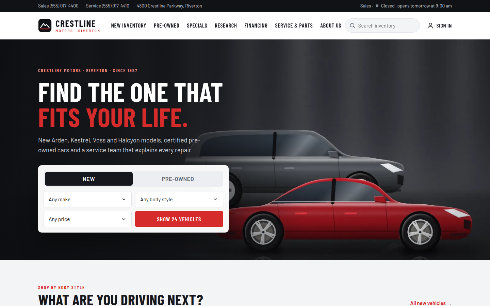
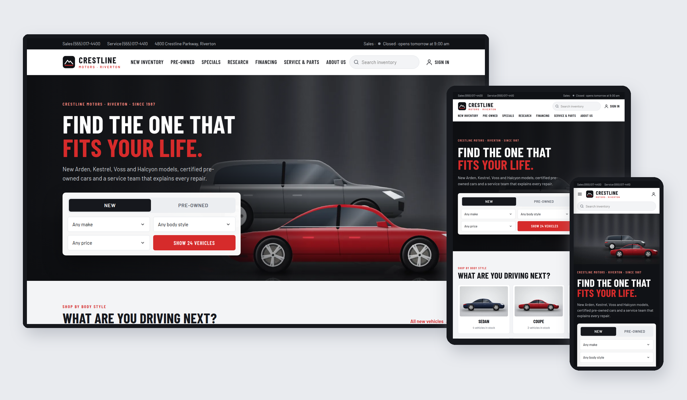

# Crestline Motors — SkyNet Car Dealer Template

A responsive car dealership website template for **ASP.NET Core (.NET 10)**, built on the **SkyNet Framework**.
Free and open source. **100% AI-driven coding — built by Claude.**

[](https://dotnet.microsoft.com/)
[](https://www.nuget.org/packages/TheSkyLite.SkyNet)
[](LICENSE)
[](#100-ai-driven-coding)

**Live demo:** https://www.theskylite.com/CarDealer



> **Fictional dealership.** Crestline Motors and the Arden, Kestrel, Voss and Halcyon brands, models, vehicles, prices, offers and rates are invented for demonstration. Test drives, service appointments, pre-qualification and sign-in are demos — nothing is reserved, financed, stored or charged.

---

## Features

- **11 pages:** Home, New Inventory, Pre-Owned, Vehicle, Specials, Research, Financing, Service & Parts, About Us, Contact, Login
- **Responsive:** desktop, tablet and phone layouts
  - Desktop: inline menu with hover mega menus for New, Pre-Owned and Service
  - Tablet: scrolling menu bar, two-column grids
  - Phone: slide-in menu with tap-to-expand sections and a filter drawer
- **Inventory:** 24 new and 24 pre-owned vehicles with make, body style, price, fuel and drivetrain filters, plus year, mileage and certified filters for pre-owned; removable filter chips and sorting by price, year or mileage
- **Vehicle page:** price box with MSRP and savings, specifications, features, vehicle history, similar vehicles and three server tools:
  - Payment estimator with tax, documentation fee, down payment, trade-in and APR by credit range and term
  - Trade-in estimate by year, body style, mileage and condition, with one click to use it in the payment
  - Test drive request, checked against sales hours (in-transit vehicles open 10 days out)
- **Service appointments:** pick services and see the price and time; open times are worked out from **6 service bays** and how long the work takes; transport choices follow the rules (wait only up to 90 minutes, loaners for longer visits while they last); advisor choice and a confirmation with a ready-by time
- **Parts:** parts request form with pickup or shipping
- **Specials:** finance, lease, cash and certified offers that end on the last day of the month, with days left worked out on the server, plus service specials that pre-select the service
- **Research:** 12 models with trims and specs in a modal, and side-by-side comparison of up to three models
- **Financing:** payment calculator, budget calculator (what can I afford, with matching cars in stock), rate table and an online pre-qualification
- **Login / My Garage:** sign in with the demo account to see saved vehicles, the next service appointment, service history and saved cars; create-account and password-reset validation
- **Site search:** live suggestions across models and inventory
- **Painted artwork:** 70 WebP illustrations — vehicles, banners and the showroom hero — painted in code by Claude; no stock photos
- **No front-end build:** plain HTML, CSS and vanilla JavaScript; no npm, no bundler, no SPA framework



---

## Getting started

**Requirements:** .NET 10 SDK and Visual Studio (or any editor with the `dotnet` CLI).

```bash
git clone https://github.com/hkim6000/SkyNet-CarDealerWebsite-Asp.net.Core-Full-Source.git
cd SkyNet-CarDealerWebsite-Asp.net.Core-Full-Source
dotnet run
```

Or open `CarDealer.csproj` in Visual Studio and press **F5**.
The SkyNet package (`TheSkyLite.SkyNet`) restores automatically from NuGet.
The app opens on **Home** — the startup page set in `appConfig/application.cfg`.

**Demo sign-in:** `demo@crestline.example` / `Drive2026!` (also shown on the Login page).

---

## Project structure

```
CarDealer/
├── appConfig/application.cfg      app settings and folder names (startup page = Home)
├── codes/                         page classes (C#)
│   ├── Models/CarDealerModel.cs   data DTOs
│   ├── Home.cs  New.cs  Vehicle.cs  Service.cs  Login.cs  ...
├── htmls/                         page markup
├── scripts/                       page JavaScript
├── styles/                        page CSS
├── data/site.json                 vehicles, models, offers, rates, services, hours
├── images/
│   ├── cars/                      inventory vehicles (WebP)
│   ├── models/                    research models (WebP)
│   ├── banners/                   page banners (WebP)
│   ├── hero.webp
│   └── logo.svg
├── Properties/launchSettings.json   hot reload off
└── Program.cs
```

### One page = four files, one name

| File | Holds |
|---|---|
| `codes/Service.cs` | the page class (`: WebPage`) and its server methods |
| `htmls/Service.html` | markup with `{plhd_*}` placeholders |
| `scripts/Service.js` | one IIFE namespace, `ServiceJs` |
| `styles/Service.css` | styles, every class prefixed (`sv-`) |

Each page is self-contained: its own CSS prefix, its own script and its own C# methods.

---

## SkyNet in action

The browser calls a C# method; the method returns an `ApiResponse`; only those parts of the page change.
One request can return one or more instructions, applied at the same time.

```js
// scripts/Service.js
$ApiRequest('Service/Slots', JSON.stringify([
    { key: 'services', vlu: 'oil.rotation' },
    { key: 'date', vlu: '2026-10-13' },
    { key: 'time', vlu: '' },
    { key: 'transport', vlu: '' }
]));
```

```csharp
// codes/Service.cs
public async Task<ApiResponse> Slots()
{
    ApiResponse response = new ApiResponse();
    SiteData site = await LoadSite();
    List<ServiceItem> chosen = Chosen(site, GetDataValue("services"));
    int minutes = Minutes(chosen);
    ...
    response.SetElementContents("sv-sum", SummaryHtml(site, chosen));
    response.SetElementContents("sv-transport", TransportHtml(site, minutes, okDate ? date : (DateTime?)null, transport));
    response.SetElementContents("sv-slots", SlotsHtml(list, date, minutes, keep == null ? string.Empty : keep.Time, today));
    return response;
}
```

| Page | Request | Response |
|---|---|---|
| every page | `Search`, `Subscribe` | suggestion list + open it; message + clear the field |
| Home | `Quick` | matching count, button link and price options |
| New, Pre-Owned | `Filter` | vehicles, count and filter chips |
| Vehicle | `Payment`, `Trade`, `TestDrive` | payment breakdown; trade-in range; field errors or confirmation |
| Specials | `Filter` | offers + count |
| Research | `Filter`, `View`, `Compare` | models + count; model details + open the modal; comparison table |
| Financing | `Payment`, `Budget`, `Prequal` | payment breakdown; price you can afford + cars in stock; field errors or pre-qualification |
| Service & Parts | `Slots`, `Book`, `Parts` | estimate, transport choices and open times; field errors or confirmation; parts request number |
| Contact | `Send` | field errors or confirmation + clear form |
| Login | `SignIn`, `CreateAccount`, `Reset` | My Garage dashboard; field errors or result |

Learn more: [SkyNet Developer Guide](https://www.theskylite.com/documents/SkyNet_Developer_Guide.html)

---

## Customize it

- **Content:** edit `data/site.json` — vehicles, models and trims, offers, credit tiers and terms, tax rate, documentation fee, services, hours, bays, transport options and advisors
- **Dealership name:** search and replace `Crestline` in `htmls/` and the page titles in `codes/`
- **Hours:** `salesHours` drives the strip status, test drive checks and Contact; `serviceHours` and `bays` drive service open times
- **Colors and fonts:** change the CSS variables at the top of each page’s stylesheet (`--hm-red`, `--hm-dark`, `--hm-cond`, …)
- **Real photos:** replace any WebP in `images/` with your own photos and keep the same file names, or update the paths in `data/site.json`

> Bay bookings, loaner counts and the demo account are simulated so the demo always looks realistic. Connect `ServiceSlots()`, the booking methods and `SignIn()` to your own scheduling system and user store. The Login page keeps no session or cookie.

---

## 100% AI-driven coding

Every file in this template — C#, HTML, CSS, JavaScript, the painted artwork and the data — was generated by Claude (Anthropic's AI) from a short instruction, directed and reviewed by the author.
No line was written by hand.

| | |
|---|---|
| Pages | 11 |
| Lines of code | ~22,700 (C#, HTML, CSS, JavaScript) |
| Images | 70 painted WebP + SVG logo |
| Vehicles / models / offers / services | 48 / 12 / 6 / 12 |
| Lines written by hand | 0 |

SkyNet's simple, predictable page model (one class, four files, `$ApiRequest` → `ApiResponse`) is what makes this possible:
the rules are few and consistent, so AI can generate complete, working pages with very few errors.

---

## License

- **This template** (all source files, artwork and data in this repository): [MIT License](LICENSE) — free to use, modify and redistribute, including commercially.
- **SkyNet Framework** (`TheSkyLite.SkyNet` NuGet package): proprietary, free to use including commercial use; see the license included in the package.

---

## Links

- Live demo: https://www.theskylite.com/CarDealer
- SkyNet Framework: https://www.theskylite.com
- NuGet package: https://www.nuget.org/packages/TheSkyLite.SkyNet
- Template #1 — Beauty store: https://github.com/hkim6000/SkyNet-BeautyWebsite-Asp.net.Core-Full-Source
- Template #2 — Pharma company: https://github.com/hkim6000/SkyNet-PharmaWebsite-Asp.net.Core-Full-Source
- Template #3 — Travel blog: https://github.com/hkim6000/SkyNet-TravelWebsite-Asp.net.Core-Full-Source
- Template #4 — Fast food restaurant: https://github.com/hkim6000/SkyNet-FastFoodWebsite-Asp.net.Core-Full-Source
- Template #5 — Fine dining restaurant: https://github.com/hkim6000/SkyNet-FineDiningWebsite-Asp.net.Core-Full-Source
- SkyNet project template: https://github.com/hkim6000/ASPNETCoreEmpty.SkyNet

© 2026 HC Kim
